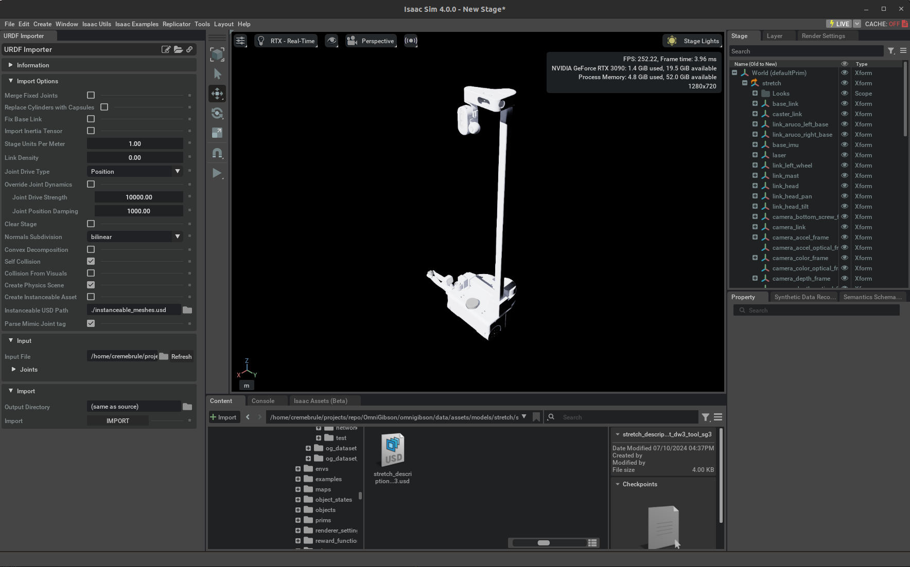
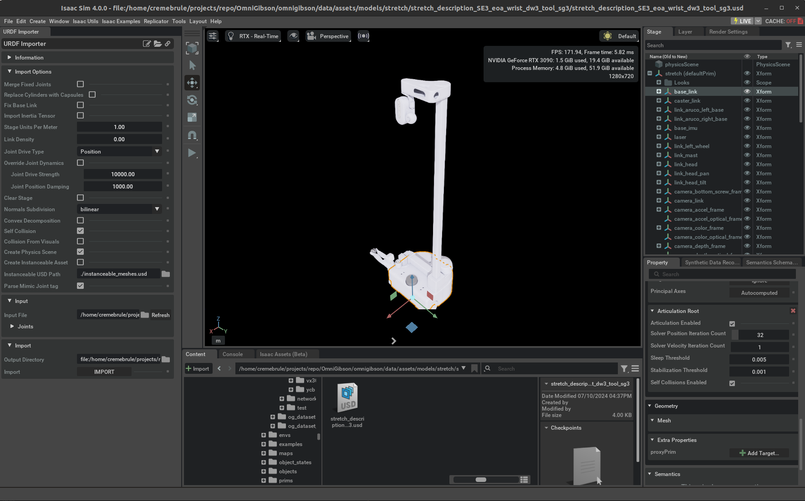
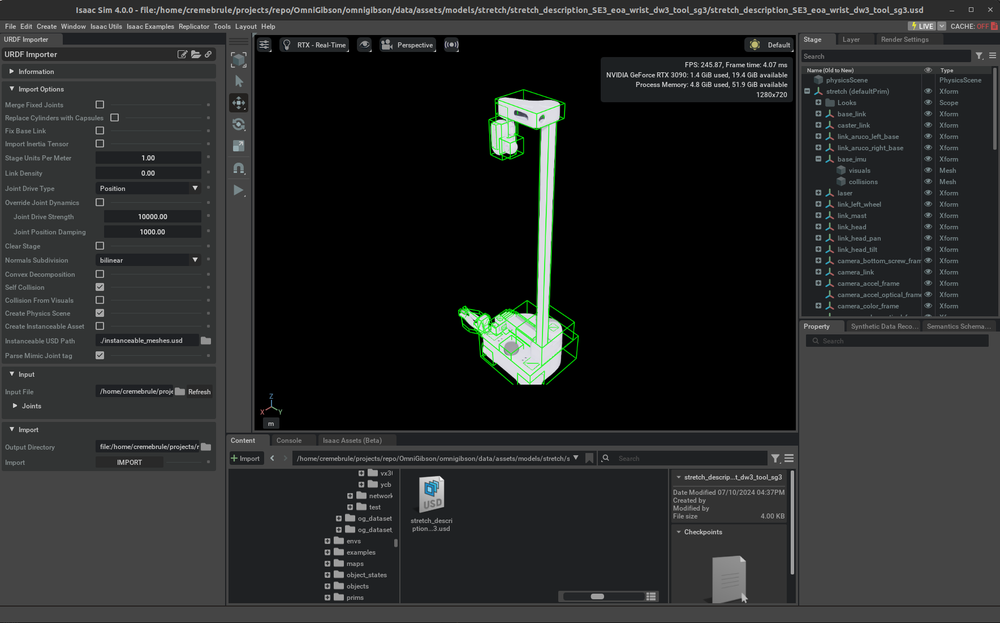

# 🕹️ **Importing a Custom Robot**

While OmniGibson assets includes a set of commonly-used robots, users might still want to import robot model of there own. This tutorial introduces users 

## Preparation

In order to import a custom robot, You will need to first prepare your robot model file. For the next section we will assume you have the URDF file for the robots ready with all the corresponding meshes and textures. If your robot file is in another format (e.g. MCJF), please convert it to URDF format. If you already have the robot model USD file, feel free to skip the next section and move onto [Create the Robot Class](#create-the-robot-class).

Below, we will walk through each step for importing a new custom robot into **OmniGibson**. We use [Hello Robotic](https://hello-robot.com/)'s [Stretch](https://hello-robot.com/stretch-3-product) robot as an example, taken directly from their [official repo](https://github.com/hello-robot/stretch_urdf).

## Convert from URDF to USD

In this section, we will be using the URDF Importer in native Isaac Sim to convert our robot URDF model into USD format. Before we get started, it is strongly recommended that you read through the official [URDF Importer Tutorial](https://docs.omniverse.nvidia.com/isaacsim/latest/features/environment_setup/ext_omni_isaac_urdf.html). 

1. Create a directory with the name of the new robot under `<PATH_TO_OG_ASSET_DIR>/models`. This is where all of our robot models live. In our case, we created a directory named `stretch`.

2. Put your URDF file under this directory. Additional asset files such as STL, obj, mtl, and texture files should be placed under a `meshes` directory (see our `stretch` directory as an example).

3. Launch Isaac Sim from the Omniverse Launcher. In an empty stage, open the URDF Importer via `Isaac Utils` -> `Workflows` -> `URDF Importer`.

4. In the `Import Options`, uncheck `Fix Base Link` (we will have a parameter for this in OmniGibson). We also recommend that you check the `Self Collision` flag. You can leave the rest unchanged.

5. In the `Import` section, choose the URDF file that you moved in Step 1. You can leave the Output Directory as it is (same as source). Press import to finish the conversion. If all goes well, you should see the imported robot model in the current stage. In our case, the Stretch robot model looks like the following:





## Process USD Model

Now that we have the USD model, let's open it up in Isaac Sim and inspect it.

1. In IsaacSim, begin by first Opening a New Stage. Then, Open the newly imported robot model USD file.

2. Make sure the default prim or root link of the robot has `Articulation Root` property

    Select the default prim in `Stage` panel on the top right, go to the `Property` section at the bottom right, scroll down to the `Physics` section, you should see the `Articulation Root` section. Make sure the `Articulation Enabled` is checked. If you don't see the section, scroll to top of the `Property` section, and `Add` -> `Physics` -> `Articulation Root`
   
    

3. Make sure every link has visual mesh and collision mesh in the correct shape. You can visually inspect this by clicking on every link in the `Stage` panel and view the highlighted visual mesh in orange. To visualize all collision meshes, click on the Eye Icon at the top and select `Show By Type` -> `Physics` -> `Colliders` -> `All`. This will outline all the collision meshes in green. If any collision meshes do not look as expected, please inspect the original collision mesh referenced in the URDF. Note that IsaacSim cannot import a pre-convex-decomposed collision mesh, and so such a collision mesh must be manually split and explicitly defined as individual sub-meshes in the URDF before importing. In our case, the Stretch robot model already comes with rough cubic approximations of its meshes.

    

4. Make sure the physics is stable:

    - Create a fixed joint in the base: select the base link of the robot, then right click -> `Create` -> `Physics` -> `Joint` -> `Fixed Joint`
    
    - Click on the play button on the left toolbar, you should see the robot either standing still or falling down due to gravity, but there should be no abrupt movements.

    - If you observe the robot moving strangely, this suggests that there is something wrong with the robot physics. Some common issues we've observed are:
    
        - Self-collision is enabled, but the collision meshes are badly modeled and there are collision between robot links.

        - Some joints have bad damping/stiffness, max effort, friction, etc.

        - One or more of the robot links have off-the-scale mass values. 

    At this point, there is unfortunately no better way then to manually go through each of the individual links and joints in the Stage and examine / tune the parameters to determine which aspect of the model is causing physics problems. If you experience significant difficulties, please post on our [Discord channel](https://discord.gg/bccR5vGFEx).

5. The robot additionally needs to be equipped with sensors, such as cameras and / or LIDARs. To add a sensor to the robot, select the link under which the sensor should be attached, and select the appropriate sensor:

    - **LIDAR**: From the top taskbar, select `Create` -> `Isaac` -> `Sensors` -> `PhysX Lidar` -> `Rotating`
    - **Camera**: From the top taskbar, select `Create` -> `Camera`

    You can rename the generated sensors as needed. Note that it may be necessary to rotate / offset the sensors so that the pose is unobstructed and the orientation is correct. This can be achieved by modifying the `Translate` and `Rotate` properties in the `Lidar` sensor, or the `Translate` and `Orient` properties in the `Camera` sensor. Note that the local camera convention is z-backwards, y-up. Additional default values can be specified in each sensor's respective properties, such as `Clipping Range` and `Focal Length` in the `Camera` sensor.

    In our case, we created a LIDAR at the `laser` link (offset by 0.01m in the z direction), and cameras at the `camera_link` link (offset by 0.005m in the x direction and -90 degrees about the y-axis) and `gripper_camera_link` link (offset by 0.01m in the x direction and 90 / -90 degrees about the x-axis / y-axis). 

    
    
    

6. Finally, save your USD! Note that you need to remove the fixed link created at step 4 before saving.

## Create the Robot Class
Now that we have the USD file for the robot, let's write our own robot class. For more information please refer to the [Robot module](../modules/robots.md).

1. Create a new python file named after your robot. In our case, our file exists under `omnigibson/robots` and is named `stretch.py`.

2. Determine which robot interfaces it should inherit. We currently support three modular interfaces that can be used together: [`LocomotionRobot`](../reference/robots/locomotion_robot.html) for robots whose bases can move (and a more specific [`TwoWheelRobot`](../reference/robots/two_wheel_robot.html) for locomotive robots that only have two wheels), [`ManipulationRobot`](../reference/robots/manipulation_robot.html) for robots equipped with one or more arms and grippers, and [`ActiveCameraRobot`](../reference/robots/active_camera_robot.html) for robots with a controllable head or camera mount. In our case, our robot is a mobile manipulator with a moveable camera mount, so our Python class inherits all three interfaces.

3. You must implement all required abstract properties defined by each respective inherited robot interface. In the most simple case, this is usually simply defining relevant metadata from the original robot source files, such as relevant joint / link names and absolute paths to the corresponding robot URDF and USD files. Please see our annotated `stretch.py` module below which serves as a good starting point that you can modify.

    ??? note "Optional properties"
     
        We offer a more in-depth description of a couple of more advanced properties for ManipulationRobots below:

        - `eef_usd_path`: if you want to teleoperate the robot using I/O devices other than keyboard, this usd path is needed to load the visualizer for the robot eef that would be used as a visual aid when teleoperating. To get such file, duplicate the robot USD file, and remove every prim except the robot end effector. You can then put the file path in the `eef_usd_path` attribute. Here is an example of the Franka Panda end effector USD:

         

        - `assisted_grasp_start_points`, `assisted_grasp_end_points`: you need to implement this if you want to use sticky grasp/assisted grasp on the new robot.
    
            These points are `omnigibson.robots.manipulation_robot.GraspingPoint` that is defined by the end effector link name and the relative position of the point w.r.t. to the pose of the link. Basically when the gripper receives a close command and OmniGibson tries to perform assisted grasping, it will cast rays from every start point to every end point, and if there is one object that is hit by any rays, then we consider the object is grasped by the robot. 
            
            In practice, for parallel grippers, naturally the start and end points should be uniformally sampled on the inner surface of the two fingers. You can refer to the Fetch class for an example of this case. For more complicated end effectors like dexterous hands, it's usually best practice to have start points at palm center and lower center, and thumb tip, and end points at each every other finger tips. You can refer to the Franka class for examples of this case.
    
            Best practise of setting these points is to load the robot into Isaac Sim, and create a small sphere under the target link of the end effector. Then drag the sphere to the desired location (which should be just right outside the mesh of the link) or by setting the position in the `Property` tab. After you get a desired relative pose to the link, write down the link name and position in the robot class. 

4. If your robot is a manipulation robot, you must additionally define a description .yaml file in order to use our inverse kinematics solver for end-effector control. Our example description file is shown below for our Stretch robot, which you can modify as needed. Place the descriptor file under `<PATH_TO_OG_ASSET_DIR>/models/<YOUR_MODEL>`.

5. In order for **OmniGibson** to register your new robot class internally, you must import the robot class before running the simulation. If your python module exists under `omnigibson/robots`, you can simply add an additional import line in `omnigibson/robots/__init__.py`. Otherwise, in any end use-case script, you can simply import your robot class from your python module at the top of the file.


??? code "stretch.py"
    ``` python linenums="1"
    import os
    import numpy as np
    from omnigibson.macros import gm
    from omnigibson.robots.active_camera_robot import ActiveCameraRobot
    from omnigibson.robots.manipulation_robot import GraspingPoint, ManipulationRobot
    from omnigibson.robots.two_wheel_robot import TwoWheelRobot
    
    
    class Stretch(ManipulationRobot, TwoWheelRobot, ActiveCameraRobot):
        """
        Stretch Robot from Hello Robotics
        Reference: https://hello-robot.com/stretch-3-product
        """
    
        @property
        def discrete_action_list(self):
            # Only need to define if supporting a discrete set of high-level actions
            raise NotImplementedError()
    
        def _create_discrete_action_space(self):
            # Only need to define if @discrete_action_list is defined
            raise ValueError("Stretch does not support discrete actions!")
    
        @property
        def controller_order(self):
            # Controller ordering. Usually determined by general robot kinematics chain
            # You can usually simply take a subset of these based on the type of robot interfaces inherited for your robot class
            return ["base", "camera", f"arm_{self.default_arm}", f"gripper_{self.default_arm}"]
    
        @property
        def _default_controllers(self):
            # Define the default controllers that should be used if no explicit configuration is specified when your robot class is created
    
            # Always call super first
            controllers = super()._default_controllers
    
            # We use multi finger gripper, differential drive, and IK controllers as default
            controllers["base"] = "DifferentialDriveController"
            controllers["camera"] = "JointController"
            controllers[f"arm_{self.default_arm}"] = "JointController"
            controllers[f"gripper_{self.default_arm}"] = "MultiFingerGripperController"
    
            return controllers
    
        @property
        def _default_joint_pos(self):
            # Define the default joint positions for your robot
    
            return np.array([0, 0, 0.5, 0, 0, 0, 0, 0, 0, 0.0, 0, 0, np.pi / 8, np.pi / 8])
    
        @property
        def wheel_radius(self):
            # Only relevant for TwoWheelRobots. Radius of each wheel
            return 0.050
    
        @property
        def wheel_axle_length(self):
            # Only relevant for TwoWheelRobots. Distance between the two wheels
            return 0.330
    
        @property
        def finger_lengths(self):
            # Only relevant for ManipulationRobots. Length of fingers
            return {self.default_arm: 0.04}
    
        @property
        def assisted_grasp_start_points(self):
            # Only relevant for ManipulationRobots. The start points for grasping if using assisted grasping
            return {
                self.default_arm: [
                    GraspingPoint(link_name="r_gripper_finger_link", position=[0.025, -0.012, 0.0]),
                    GraspingPoint(link_name="r_gripper_finger_link", position=[-0.025, -0.012, 0.0]),
                ]
            }
    
        @property
        def assisted_grasp_end_points(self):
            # Only relevant for ManipulationRobots. The end points for grasping if using assisted grasping
            return {
                self.default_arm: [
                    GraspingPoint(link_name="l_gripper_finger_link", position=[0.025, 0.012, 0.0]),
                    GraspingPoint(link_name="l_gripper_finger_link", position=[-0.025, 0.012, 0.0]),
                ]
            }
    
        @property
        def disabled_collision_pairs(self):
            # Pairs of robot links whose pairwise collisions should be ignored.
            # Useful for filtering out bad collision modeling in the native robot meshes
            return [
                ["base_link", "caster_link"],
                ["base_link", "link_aruco_left_base"],
                ["base_link", "link_aruco_right_base"],
                ["base_link", "base_imu"],
                ["base_link", "laser"],
                ["base_link", "link_left_wheel"],
                ["base_link", "link_right_wheel"],
                ["base_link", "link_mast"],
                ["link_mast", "link_head"],
                ["link_head", "link_head_pan"],
                ["link_head_pan", "link_head_tilt"],
                ["camera_link", "link_head_tilt"],
                ["camera_link", "link_head_pan"],
                ["link_head_nav_cam", "link_head_tilt"],
                ["link_head_nav_cam", "link_head_pan"],
                ["link_mast", "link_lift"],
                ["link_lift", "link_aruco_shoulder"],
                ["link_lift", "link_arm_l4"],
                ["link_lift", "link_arm_l3"],
                ["link_lift", "link_arm_l2"],
                ["link_lift", "link_arm_l1"],
                ["link_arm_l4", "link_arm_l3"],
                ["link_arm_l4", "link_arm_l2"],
                ["link_arm_l4", "link_arm_l1"],
                ["link_arm_l3", "link_arm_l2"],
                ["link_arm_l3", "link_arm_l1"],
                ["link_arm_l2", "link_arm_l1"],
                ["link_arm_l0", "link_arm_l1"],
                ["link_arm_l0", "link_arm_l2"],
                ["link_arm_l0", "link_arm_l3"],
                ["link_arm_l0", "link_arm_l4"],
                ["link_arm_l0", "link_arm_l1"],
                ["link_arm_l0", "link_aruco_inner_wrist"],
                ["link_arm_l0", "link_aruco_top_wrist"],
                ["link_arm_l0", "link_wrist_yaw"],
                ["link_arm_l0", "link_wrist_yaw_bottom"],
                ["link_arm_l0", "link_wrist_pitch"],
                ["link_wrist_yaw_bottom", "link_wrist_pitch"],
                ["gripper_camera_link", "link_gripper_s3_body"],
                ["link_gripper_s3_body", "link_aruco_d405"],
                ["link_gripper_s3_body", "link_gripper_finger_left"],
                ["link_gripper_finger_left", "link_aruco_fingertip_left"],
                ["link_gripper_finger_left", "link_gripper_fingertip_left"],
                ["link_gripper_s3_body", "link_gripper_finger_right"],
                ["link_gripper_finger_right", "link_aruco_fingertip_right"],
                ["link_gripper_finger_right", "link_gripper_fingertip_right"],
                ["respeaker_base", "link_head"],
                ["respeaker_base", "link_mast"],
            ]
    
        @property
        def base_joint_names(self):
            # Names of the joints that control the robot's base
            return ["joint_left_wheel", "joint_right_wheel"]
    
        @property
        def camera_joint_names(self):
            # Names of the joints that control the robot's camera / head
            return ["joint_head_pan", "joint_head_tilt"]
    
        @property
        def arm_link_names(self):
            # Names of the links that compose the robot's arm(s) (not including gripper(s))
            return {
                self.default_arm: [
                    "link_mast",
                    "link_lift",
                    "link_arm_l4",
                    "link_arm_l3",
                    "link_arm_l2",
                    "link_arm_l1",
                    "link_arm_l0",
                    "link_aruco_inner_wrist",
                    "link_aruco_top_wrist",
                    "link_wrist_yaw",
                    "link_wrist_yaw_bottom",
                    "link_wrist_pitch",
                    "link_wrist_roll",
                ]
            }
    
        @property
        def arm_joint_names(self):
            # Names of the joints that control the robot's arm(s) (not including gripper(s))
            return {
                self.default_arm: [
                    "joint_lift",
                    "joint_arm_l3",
                    "joint_arm_l2",
                    "joint_arm_l1",
                    "joint_arm_l0",
                    "joint_wrist_yaw",
                    "joint_wrist_pitch",
                    "joint_wrist_roll",
                ]
            }
    
        @property
        def eef_link_names(self):
            # Name of the link that defines the per-arm end-effector frame
            return {self.default_arm: "link_grasp_center"}
    
        @property
        def finger_link_names(self):
            # Names of the links that compose the robot's gripper(s)
            return {self.default_arm: ["link_gripper_finger_left", "link_gripper_finger_right", "link_gripper_fingertip_left", "link_gripper_fingertip_right"]}
    
        @property
        def finger_joint_names(self):
            # Names of the joints that control the robot's gripper(s)
            return {self.default_arm: ["joint_gripper_finger_right", "joint_gripper_finger_left"]}
    
        @property
        def usd_path(self):
            # Absolute path to the native robot USD file
            return os.path.join(gm.ASSET_PATH, "models/stretch/stretch/stretch.usd")
    
        @property
        def urdf_path(self):
            # Absolute path to the native robot URDF file
            return os.path.join(gm.ASSET_PATH, "models/stretch/stretch.urdf")
    
        @property
        def robot_arm_descriptor_yamls(self):
            # Only relevant for ManipulationRobots. Absolute path(s) to the per-arm descriptor files (see Step 4 below)
            return {self.default_arm: os.path.join(gm.ASSET_PATH, "models/stretch/stretch_descriptor.yaml")}
    ```

??? code "stretch_descriptor.yaml"
    ``` yaml linenums="1"

    # The robot descriptor defines the generalized coordinates and how to map those
    # to the underlying URDF dofs.

    api_version: 1.0
    
    # Defines the generalized coordinates. Each generalized coordinate is assumed
    # to have an entry in the URDF, except when otherwise specified below under
    # cspace_urdf_bridge
    cspace:
        - joint_lift
        - joint_arm_l3
        - joint_arm_l2
        - joint_arm_l1
        - joint_arm_l0
        - joint_wrist_yaw
        - joint_wrist_pitch
        - joint_wrist_roll
    
    root_link: base_link
    subtree_root_link: base_link
    
    default_q: [
        # Original version
        # 0.00, 0.00, 0.00, -1.57, 0.00, 1.50, 0.75
    
        # New config
        0, 0, 0, 0, 0, 0, 0, 0
    ]
    
    # Most dimensions of the cspace have a direct corresponding element
    # in the URDF. This list of rules defines how unspecified coordinates
    # should be extracted.
    cspace_to_urdf_rules: []
    
    active_task_spaces:
        - base_link
        - lift_link
        - link_mast
        - link_lift
        - link_arm_l4
        - link_arm_l3
        - link_arm_l2
        - link_arm_l1
        - link_arm_l0
        - link_aruco_inner_wrist
        - link_aruco_top_wrist
        - link_wrist_yaw
        - link_wrist_yaw_bottom
        - link_wrist_pitch
        - link_wrist_roll
        - link_gripper_s3_body
        - gripper_camera_link
        - link_aruco_d405
        - link_gripper_finger_left
        - link_aruco_fingertip_left
        - link_gripper_fingertip_left
        - link_gripper_finger_right
        - link_aruco_fingertip_right
        - link_gripper_fingertip_right
        - link_grasp_center
    
    composite_task_spaces: []
    ```


## Deploy Your Robot!

You can now try testing your custom robot! Import and control the robot by launching `python omnigibson/examples/robot/robot_control_examples.py`! Try different controller options and teleop the robot with your keyboard, If you observe poor joint behavior, you can inspect and tune relevant joint parameters as needed. This test also exposes other bugs that may have occurred along the way, such as missing / bad joint limits, collisions, etc. Please refer to the Franka or Fetch robots as a baseline for a common set of joint parameters that work well. This is what our newly imported Stretch robot looks like in action:

 


